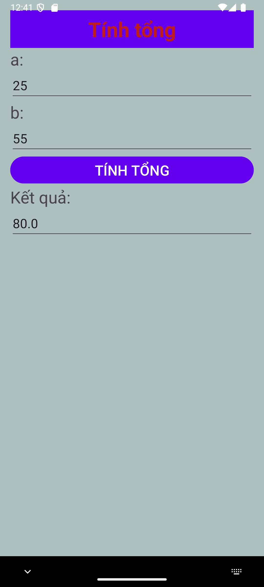
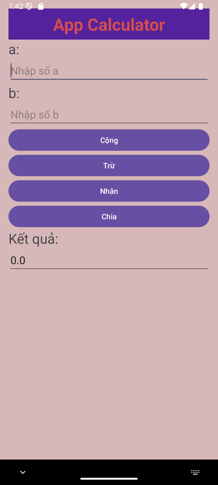
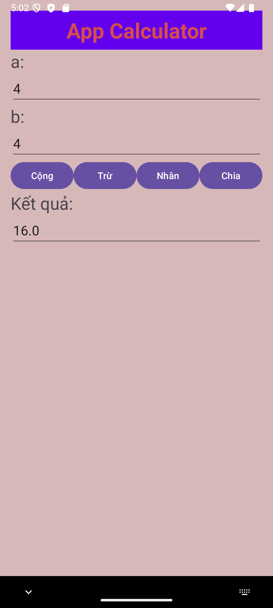

# 62132949-AndroidProgrammin
Lưu các bài tập thực hành trong lập trình android

Màn hình giao diện chính của các ứng dụng:

- [Ex3_SimpleSumApp (Tính tổng)](#ex3_simplesumapp-tinh-tong)
- [Ex4_AddSubMulDiv_Onclick](#ex4_addsubmuldiv_onclick)
- [Ex5_AddSubMulDiv_Anonymous](#ex5_addsubmuldiv_anonymous)
- [App tính BMI](#app-tinh-bmi)

### Ex3_SimpleSumApp (Tính tổng) 

### Ex4_AddSubMulDiv_Onclick

### Ex5_AddSubMulDiv_Anonymous

### App tính BMI

