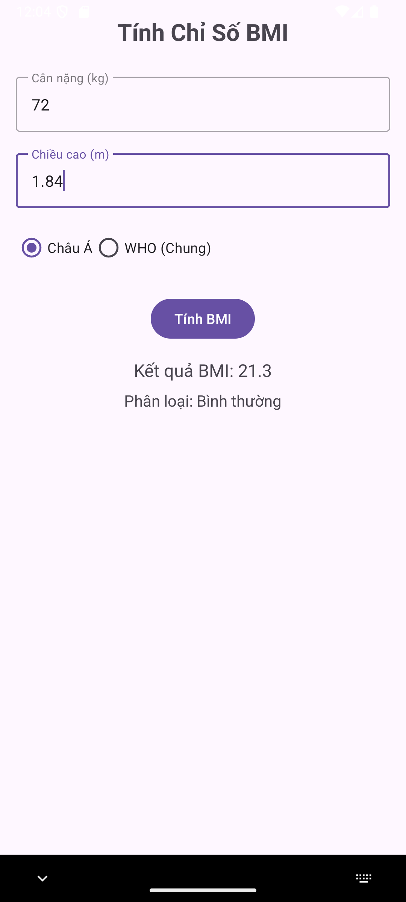

# 62132949-AndroidProgrammin
Lưu các bài tập thực hành trong lập trình android

Màn hình giao diện chính của các ứng dụng:

- [Ex3_SimpleSumApp - Tính tổng](#ex3-simplesumapp-tinh-tong)
- [Ex4_AddSubMulDiv Onclick](#ex4-addsubmuldiv-onclick)
- [Ex5_AddSubMulDiv Anonymous](#ex5-addsubmuldiv-anonymous)
- [Ex6_Intent DonGian](#ex6-intent-dongian)
- [App tính BMI](#app-tinh-bmi)
- [Ex7_Intent Login](#ex7_intent-login)
- [Login screen](#login-screen)
- [Modern Dashboard](#modern-dashboard)

### Ex3_SimpleSumApp - Tính tổng

### Ex4_AddSubMulDiv Onclick

### Ex5_AddSubMulDiv Anonymous

### Ex6_Intent DonGian

### Ex7_Intent Login

### App tính BMI

### Login screen

### Modern Dashboard

